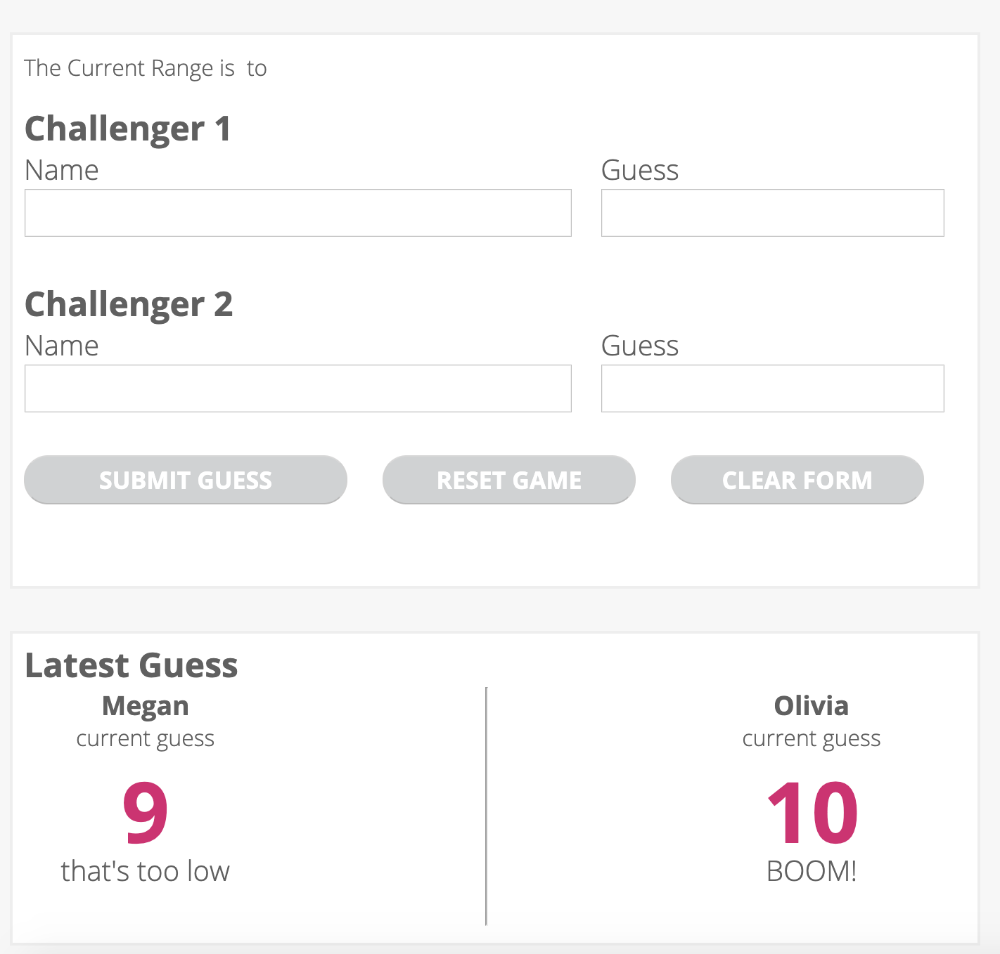
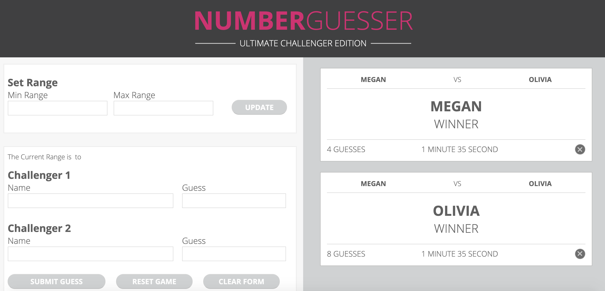

# Number-Guesser-Pair

Project: Number Guesser

Group Member Names: Olivia Webster and Megan Venetianer

In this game the players will first select a range of numbers they want to guess in. The computer will then choose a random number within that range and the players will put their names in and each guess a number within that range. If they try to guess a number outside of the range they will get an error message and be forced to guess again. After the players submit their guesses they will each get a hint about whether their guess is too high or too low, and they will have the opportunity to guess again. After a player wins the game a winner card will be generated on the right side of the screen that shows who won the game. The players can repeat this with a new number, and when somebody has won a new winner card will be generated. Below are a couple of screenshots from the game.

text: 

text: 
